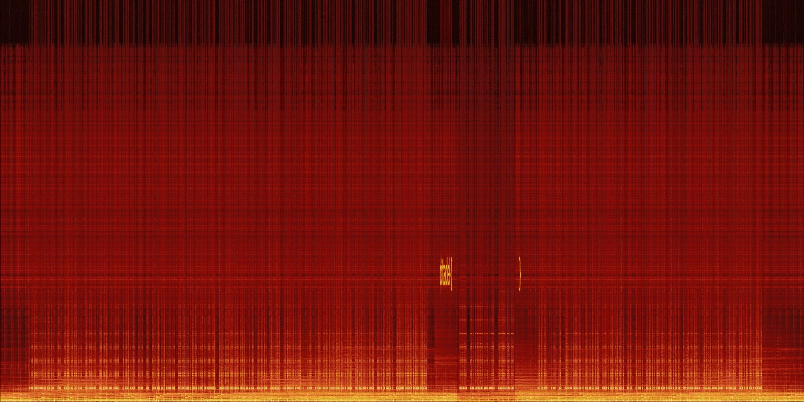
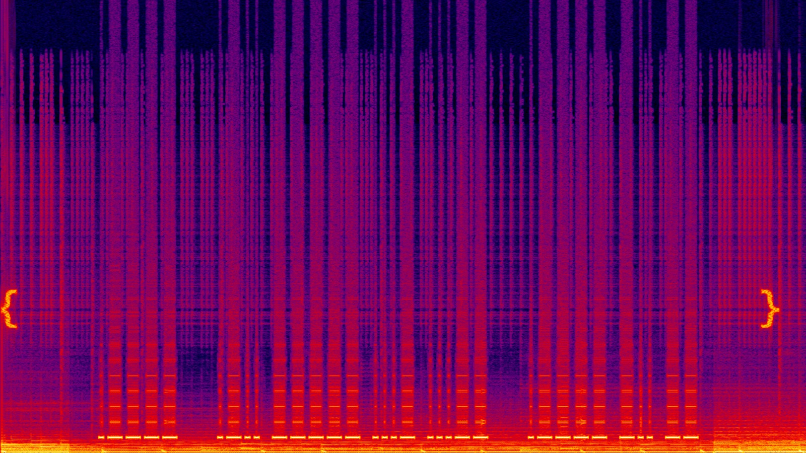

# CitadelCTF Writeups

## Challenge1: Zahard's welcome 

### Solve
- Flag was present in discord channel rules description

---

## Challenge2: The Social Network

### Solve
- Flag was there in the story 

**Flag:** `citadel{17_1s_jus7_7h3_b3g1nn1ng}`

---

## Challenge3: Omniscient Flag's Metadata

### Solve
First used the exiftools website https://exif.tools/ and then got `kdj had a habit of hiding images` later put it on binwalke to extract the image which had the flag written on it. 

**Flag:** `citadel{th1s_ch4ll3ng3_1s_f0r_th4t_0n3_ex1ft00l_4nd_b1nw4lk_enthus14st}`

---

## Challenge4: Track 8

### Solve
- Not done by me 

**Flag:** `citadel{add_vinegar_twice}`

## Challenge5: Test of Sweetness

### Solve
There was a cookie called `user` which we changed to admin and then got the flag 

**Flag:** `citadel{fru1tc4k3_4nd_c00k13s}`

---

## Challenge6: Rotten Apple

### Solve
- Not done by me 

**Flag:** `citadel{b3tt3r_ROTt3n}`

---

## Challenge7: Randomly Accessed Memories

## Solve
- Not done by me 

**Flag:** `citadel{w3_4r3_up_4ll_n1t3_t0_g1t_lucky}`

---

## Challenge8: Selected Ambient Work

### Solve
We searched up the spectogram of the audio file 
 
and then manually trimmed it in audacity and continued looking for the exact portion enclosed in brackets. Later, tried to use an online morse code tool but it didn't work. Hence manually we converted morse code into the text i.e. `.----   .-.. ----- ...- ...--   .---- -.. --` to `1 L0V3 1DM`. 


**Flag:** `citadel{1_L0V3_1DM}`

---

## Challenge 9: The Robot's Trail

### Solve
We opened the robots/txt by inspect element

```
User-agent: *

# We value our digital privacy and have restricted access to certain system-level configurations.
Disallow: /file?path=../../etc/passwd
Disallow: /file?path=../../../etc/passwd

# Hint for curious explorers: 
# Sometimes system files like /etc/passwd can reveal interesting information...
# But remember to respect privacy boundaries!
```
Now we took /etc/passwd to the url and got this:

```
"root:x:0:0:root:/root:/bin/bash\n"
"daemon:x:1:1:daemon:/usr/sbin:/usr/sbin/nologin\n"
"bin:x:2:2:bin:/bin:/usr/sbin/nologin\n"
"sys:x:3:3:sys:/dev:/usr/sbin/nologin\n"
"nobody:x:65534:65534:nobody:/nonexistent:/usr/sbin/nologin\n"
"webadmin:x:1000:1000:Check the web server config at /var/www/html/config.php:/home/webadmin:/bin/bash\n"
```

after tryping /home/webadmin:/bin/bash we got a secret password - `s3cr3t_p@ssw0rd';\n`

so we tried the `/file?path=/var/log/apache2/access.log`

```
"127.0.0.1 - - [01/Jan/2023:10:30:45 +0000] \"GET / HTTP/1.1\" 200 1234 \"-\" \"Mozilla/5.0\"\n"
"192.168.1.100 - - [01/Jan/2023:10:31:22 +0000] \"GET /file?path=../../etc/passwd HTTP/1.1\" 200 567 \"-\" \"Python-urllib\"\n"
"10.0.0.50 - - [01/Jan/2023:10:32:15 +0000] \"GET /admin HTTP/1.1\" 404 289 \"-\" \"curl\"\n"
"# Interesting environment variables might be found at /proc/self/environ\n"
"203.0.113.5 - - [01/Jan/2023:10:33:01 +0000] \"POST /login HTTP/1.1\" 302 - \"-\" \"Mozilla/5.0\"\n"
```
It gave the next location  `"# Interesting environment variables might be found at /proc/self/environ\n"`
and then we went to `/file?path=/proc/self/environ` and got

```
"PATH=/usr/local/sbin:/usr/local/bin:/usr/sbin:/usr/bin:/sbin:/bin\n"
"HOSTNAME=web-server-01\n"
"USER=www-data\n"
"HOME=/var/www\n"
"SECRET_LOCATION=/home/ctf/.secret\n"
"PWD=/var/www/html\n"
"LANG=C.UTF-8\n"
"SHLVL=1\n"
```

later we went to `/home/ctf/.secret/flag.txt` adn got the text file

**Flag:** `citadel{p4th_tr4v3rs4l_m4st3ry_4ch13v3d}`

---

## Challenge 10: Rotting in the Deep

### Solve
- Not solved by me 

**Flag:** `citadel{br0_r34lly_unr0tt3d_m3_b4ck_t0_l1f3}`

---

## Challenge 11: Coco Conjecture

### Description
The door to the next floor is guarded by a figure who calls herself "the dragon CEO". She does not speak of mercy or choice. only of order and efficiency.

To enter the next chamber, you must complete the task presented by her. Complete it exactly as instructed, achieving operational efficiency by her standards, and the path forward will open.

### Solve
Made a python file to communicate to terminal ... 

```py
import time
import socket

BLUE = '\033[94m'
GREEN = '\033[92m'
RED = '\033[31m'
END = '\033[0m'

def collatz_steps(n):
    steps = 0
    while n != 1:
        if n % 2 == 0:
            n //= 2
        else:
            n = 3 * n + 1
        steps += 1
    return steps

host = 'chall_citadel.cryptonitemit.in'
port = 61234

s = socket.create_connection((host, port), timeout=5)

data = s.recv(1024).decode().split(" ")
print(BLUE ,data ,END)

# extract number from server message
number = int(((data[-3])[-6::-1])[::-1])
print(RED, number, END)

answer = collatz_steps(number)
print(GREEN, answer, END)

# send answer with newline
s.sendall(f"{answer}\n".encode())

for i in range(368):
    data = s.recv(1024).decode().split(" ")
    print(BLUE ,data ,END)

    # extract number from server message
    number = int(((data[-3])[-6::-1])[::-1])
    print(RED, number, END)

    answer = collatz_steps(number)
    print(GREEN, answer, END)

    # send answer with newline
    s.sendall(f"{answer}\n".encode())

s.close()
```

**Flag:** `citadel{k1ryu_c0c0_h4s_4_g0_4t_4n_uns0lv3d_m4th3m4t1cs_pr0bl3m}`

---

## Challenge 12: Schlagenheim

### Solve
- It was not a WAV file but a MIDI file from the header... I couldn't proceed further so my teammates proceeded to extract info from it  

**Flag:** `citadel{8lackM1D1wa5c00l}`

---

## Challenge 13: XOR Slide

### Solve
- Tried diff things but later gave up and Chatgpt gave us the flag
- Below is what I tried to do... but ig doesn't make sense
```py
import os
flag = bytearray.fromhex("b31113bd631c7207ec9587b32e686c8b6df255d66f4a987adacf6c283875ded5d1633b5f8823fa0b9bbbfab3195f1a51506afd54e03392ae338d872445c9025d88c8d4425a00a9b4478f86acadbd781df6a4194e376c09145a6f9afcbe02d36b5709f74d910edf94552dc4680041d6717fea824718c21385bdfd6176f722100548336d10ead87f01a95c5497dcb6c2")
wrapper = [
    b'bro i have a cRAzy story to tell you i went to ant4rctica and BOOM i saw a random ', 
    b' it was crazy like how did it get there??'
] 
ks = bytearray(os.urandom(len(wrapper[0] + wrapper[1]) + 9))
for i in range(len(flag) - len(ks) + 1):
    for j in range(len(ks)):
        ks[j] = flag[i + j] ^ plaintext[i + j]

print(flag)
print(ks)

for i in range(len(flag) - len(ks) + 1):
    for j in range(len(ks)):
        flag[i + j] = flag[i + j] ^ ks[j]

print(flag.hex())
```

**Flag:** `citadel{pyr4m1d+x0r}`

---

## Challenge 14: The Sound of Music

### Solve
We went to lastbox and there got the user citadweller. In the shoutbox there was first flag. 
`citadel{c0mputers_st0pped_exchang1ng_1nf0rmat10n`
Then later rateyourmusic we got same profile rating which had the next half
`_n_started_shar1ng_st0r1es`
Then we got to spotify where we found citadweller and got the last flag 
`_n_then_they_were_n0where_t0_be_f0und}`

Perplexity helped a lot cz we just told it to spann throgh the music sites and it gave us list and even fetched us two of the flags in the way 

**Flag:** `citadel{c0mputers_st0pped_exchang1ng_1nf0rmat10n_n_started_shar1ng_st0r1es_n_then_they_were_n0where_t0_be_f0und}`

---

## Challenge 15: Echoes and Pings

### Solve 
Not done by me

**Flag:** `citadel{1_r34lly_w4nt_t0_st4y_4t_y0ur_h0us3}`

---

## Challenge 16: The Ripper

### Description
The guardian of this floor steps from the shadows. Known only as Jack the Ripper, he watches you carefully. He proclaims himself merciful and hands you a word list to help. He asks you to find the passcode hidden in this hash `$2a$04$RNoyoWAcW0StwSri4YN1Eeb2j1gBNKutDOMxsLzfyfSvB/ghMHToa`. The word list is your only aid. Only by combining the two correctly can you uncover the key and move on to the next floor. Flag format: `citadel{password}`

### Solve
we knew the hash `$2a$04$RNoyoWAcW0StwSri4YN1Eeb2j1gBNKutDOMxsLzfyfSvB/ghMHToa` and that it started with `citadel{}` so we used https://hashes.com/en/decrypt/hash

**Flag:** `citadel{fake_flag_4_fake_pl4y3rs}`

---

## Challenge 17: AetherCorp NetprobeX

- Couldn't solve...